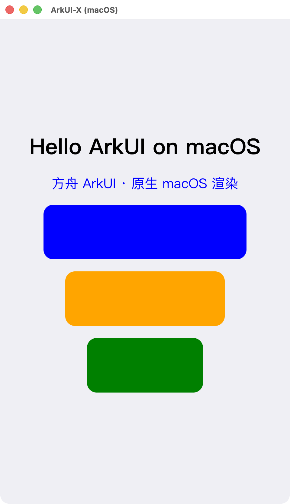

# ArkUI-X 原生 macOS 移植 · M1 达成

[](https://github.com/sanchuanhehe/arkui-x-macos-native/actions/workflows/ci.yml)

把**完整标准 ArkUI**(声明式 ArkUI + 方舟 `ets_runtime` + skia + RenderService + napi + mmi)移植到 **macOS(Apple Silicon)原生桌面**——不依赖 iOS 模拟器、不依赖 DevEco 运行时,直接以 **AppKit** 跑起 `.ets` 页面。

> **M1 ✅:用官方 `ace build bundle`(DevEco hvigor + OpenHarmony SDK)编出的标准 stage app,在原生 AppKit 窗口里真实渲染出 ArkUI 页面。**
> 声明式 `@Entry @Component` → 方舟运行时 → RenderService → NSOpenGLContext/CAOpenGLLayer → 屏幕。**中英文文字(CoreText)、颜色、圆角、布局**均已渲染。



> 上图:`ace_macos` 原生窗口里,一个标准 ArkUI 页面(中英文 `Text` + 三个彩色圆角 `Row`,居中布局)被 RenderService 真实渲染上屏。从 GN 编译到这一帧,全链由真构建系统(gn/ninja + Xcode clang)产出,无手工 `.o`、`third_party` 仅 1 处必要去重。

---

## 这套移植到底跑通了什么

完整的端到端链路,每一段都可复现:

| 段 | 内容 | 状态 |
|--|--|--|
| **A 渲染地基** | GN `target_os=mac` 管线 + macOS 图形后端(把 iOS 的 EAGL/UIKit/OpenGLES 改写为 **NSOpenGLContext + CALayer + 桌面 GL 离屏 FBO**;`CADisplayLink→CVDisplayLink`) | ✅ |
| **B 窗口层** | `ace_engine/adapter/macos/`(~150 文件):`virtual_rs_window`(UIWindow→NSWindow)、`WindowView`(NSView + `WindowGLLayer:CAOpenGLLayer`)、`main.mm`+`MacAppDelegate`(独立可执行,免 Xcode 工程)、stage/ability(NSViewController)、osal、uicontent | ✅ |
| **C 整框架编通** | `libace_static_mac` 全编通:**7224 个 .o / 23 个静态库 / 184.5MB**,含 skia/napi/graphic_2d/ets_runtime/mmi/image_framework 全部传递依赖 | ✅ |
| **D 可执行 + 开窗** | `ace_macos`(122MB arm64,0 undefined)链出 → `NSApplicationMain` → 原生 AppKit 窗口 | ✅ |
| **E 干净 app** | 用官方 `developtools/ace_tools`(`ace build bundle`)+ DevEco hvigor + OpenHarmony SDK,把标准 `@Entry` 工程编成可加载的 `.abc` bundle | ✅ |
| **F 渲染上屏** | ability 全生命周期 → 页面加载 → RenderService 渲染树 → CAOpenGLLayer blit → **ArkUI 页面显示在屏幕上** | ✅ |

---

## 复现(从零到这一帧)

### 0. 环境
- macOS,Apple Silicon(在 macOS 26 / Xcode 全装上验证)
- **完整 Xcode**:`sudo xcode-select -s /Applications/Xcode.app/Contents/Developer`,构建/运行均需 `export DEVELOPER_DIR=/Applications/Xcode.app/Contents/Developer`
- **Rosetta**(arkui-x 工具链含 x64 node):`softwareupdate --install-rosetta`
- ArkUI-X 源码 + `./build/prebuilts_download.sh`(~10GB)
- 编 demo bundle 需 **DevEco-Studio.app**(内含 hvigor/ohpm/node/SDK)+ 本机装有 **OpenHarmony SDK**

### 1. 应用补丁
```bash
scripts/check_patches.sh            # (可选)先自检补丁集完整性,不需源码
scripts/apply_patches.sh /path/to/arkui-x
```
各仓基线 commit 见 `patches/BASE_COMMITS.txt`;脚本在 **15 个仓**建 `mac-port` 分支并 `git apply`。
每个仓应用 `<name>.patch`(单补丁),或 `<name>-*.patch`(拆分补丁集,按名排序)。**ace_engine 体量大,已拆为补丁集**:`ace_engine-1-adapter-macos`(174 文件,macOS 窗口层)、`ace_engine-2-framework`(13 文件,渲染管线 + gate)、`ace_engine-3-build`(5 文件,BUILD.gn/config)。

> **幂等可复现**:`apply_patches.sh` 对每个补丁先 `git apply --reverse --check`,已应用则跳过——重复运行安全、不会重复打或报错。复现的三个锚点:① `patches/BASE_COMMITS.txt` 钉死每仓基线 commit;② 上面 `--gn-args` 钉死构建开关;③ CI(`.github/workflows/ci.yml`)每次提交校验补丁集可解析、每仓有补丁与基线、无孤儿补丁、脚本 shellcheck 干净。本地等价校验:`scripts/check_patches.sh`。

### 2. 编整框架 + 可执行
```bash
cd /path/to/arkui-x
export DEVELOPER_DIR=/Applications/Xcode.app/Contents/Developer
./build.sh --product-name arkui-x --target-os mac --gn-args '
  target_cpu="arm64"
  mac_use_ios_backend=true
  use_xcode_clang=true
  graphic_2d_feature_enable_vulkan=false
  skia_feature_use_vulkan=false
  skia_enable_fontmgr_ohos=false
  skia_use_fonthost_mac=true '   # CoreText 字体端口:渲染中英文文字
# 或 gn gen 后直接:
#   ninja -C out/arkui-x libace_static_mac   # 整框架(184.5MB)
#   ninja -C out/arkui-x ace_macos           # 可执行
```

### 3. 编一个 ArkUI 应用 bundle(官方正门)
```bash
# 配置 ace 指向 DevEco 自带工具链
DEVECO=/Applications/DevEco-Studio.app
node $ARKUIX/developtools/ace_tools/ace_tools/lib/ace_tools.js config \
  --deveco-studio-path "$DEVECO" \
  --ohpm-dir "$DEVECO/Contents/tools/ohpm" \
  --nodejs-dir "$DEVECO/Contents/tools/node" \
  --java-sdk "$DEVECO/Contents/jbr/Contents/Home" \
  --openharmony-sdk "$HOME/Library/OpenHarmony/Sdk" \
  --source-dir "$ARKUIX"
# 在标准 @Entry 工程目录(runtimeOS=OpenHarmony)里:
cd samples/BasicFeature/HelloWorld   # demo/HelloWorld-entry 是本仓自带的最小页面
node $ARKUIX/.../ace_tools.js build bundle
# 产物:.arkui-x/ios/arkui-x/<module>/ets/modules.abc + module.json + resources
```
把 `.arkui-x/.../arkui-x/<module>/` 拷到 `out/arkui-x/arkui/ace_engine/arkui-x/<module>/`,并把 `MacAppDelegate.mm` 里的 `BUNDLE_NAME/MODULE_NAME/ABILITY_NAME` 指向你的应用。系统模块 `.abc`(uiability/hilog/context/uicontext/arktheme/resmgr 及全套 `arkui.components.*`)从 `out/.../ace_engine_cross/*.abc` 拷进 `arkui-x/systemres/abc/`(本仓 `assets/systemres_abc/` 附了一组示例 + 重建说明)。

### 4. 跑
```bash
export DEVELOPER_DIR=/Applications/Xcode.app/Contents/Developer
out/arkui-x/arkui/ace_engine/ace_macos
```

---

## 一路啃下来的硬坑(精华)

**编译/链接阶段**
- **GN 重复规则**:skcms.o 被两 target 重复生成(预存 latent bug)、ets2panda copy 产物跨 toolchain 重复 → `ninja` 加载失败;逐处 mac-gate 去重。
- **`-Werror=unknown-warning-option`**(184×):Xcode clang 不识别某 warning → mac 下移除该 `-Werror`,一处清零。
- **IOS_PLATFORM 复用塌缩**:跨平台模块 mac 同时定义 `IOS_PLATFORM+MAC_PLATFORM`,复用 iOS 分支,一把消掉一批 `jni.h`/头文件 not-found。
- **Carbon `Component` 撞名**:AppKit 经 CoreServices 带入 `typedef ComponentRecord* Component`,撞 ets_runtime `enum class Component` → `#define`/`#undef` 隔离 AppKit 解析。
- **PREVIEW 误判** / **napi 引擎 Linux-ism(epoll/pthread)** / **securec** / **mmi `<linux/types.h>`** / **UIKit→AppKit** / 26 处 `adapter/ios`→`adapter/macos` include。

**运行时 / 内容加载**
- 共享 VM 的 **bundle vs esmodule** 模式(`LoadJsWithModule` 补 `SetBundle(false)`)、mac `GetOutEntryPoint` record 名重复前缀、逐个补齐系统模块 `.abc`。

**渲染管线(最隐蔽的一段,五层逐一剥开)**
1. mac 从不 `Init` RSUIDirector → transaction 无 `renderThreadClient_` → 页面树 commit 被静默丢弃 → 用公开 API 补 client + 启 RS 渲染线程;
2. RS 渲染线程**一次性 vsync**(CVDisplayLink one-shot)→ 渲一帧空树后睡死 → mac 下持续 `RequestNextVSync`;
3. **双 director**:页面经 RosenWindow 的 director 渲染,client 要设在它的 context 上;
4. stage 首帧 0×0 早退不标脏 → 页面子树几何为 0 → mac-gate 标脏(随后 root/stage/page/Column 全部 960×1600);
5. **真因**:`CAOpenGLLayer` 的 pixel format 与 `render_context` 的 **Core 3.2 不匹配** → `CGLCreateContext` 共享组失败(err 10009)→ 退回非共享 context → RS 画的 colorbuffer 对窗口**不可见**。修法:layer 强制 Core 3.2;**FBO id 不跨 context 共享,但 renderbuffer 跨**,故用 render_context 的共享 colorbuffer 挂进窗口自己的 FBO 再 blit。

> 截图见 `screenshots/`:`ace_macos_window.png`(开窗)、`ace_c1_fbo_blit.png`(GL 出图链路验证)、`M1_arkui_rendered.png`(M1 真渲染)。

---

## 改动范围(15 仓,`third_party` 仅 1 处必要 skcms 去重)

| 仓 | 说明 |
|--|--|
| **ace_engine**(拆为 3 子补丁) | `-1-adapter-macos` 窗口层 / `-2-framework` 渲染管线+gate / `-3-build` gn(主体) |
| **appframework** | macOS 图形后端(NSOpenGL/CALayer/桌面 FBO)+ window_manager/ability cross-platform mac 化 |
| **graphic_2d** | 平台路由 / rosen mac / `render_context` 暴露 colorbuffer / RS 渲染线程 mac 持续渲染 |
| **build / build_plugins** | `BUILDCONFIG` mac 分支 / `toolchain/mac` / `find_sdk` |
| **ets_runtime** | mac `GetOutEntryPoint` record 名对齐 |
| **napi / input** | mac 非 PREVIEW(is_arkui_x)+ 引擎走 iOS 分支 / mmi 避 `<linux/types.h>` |
| **image_framework / ets_frontend / runtime_core** | mac-as-ios include + mock 头去冲突 / ets2panda copy 跨 toolchain 去重 |
| **skia** | **唯一 third_party 例外**:skcms.o 重复规则去重 + fontmgr 依赖 arkui-x gate(均单 `if` 分支) |
| **sdk-js / hilog / c_utils** | api/arkts/kits 去重 / mac CFRunLoop 分支 / mac 适配 |

完整设计与逐文件改写见 **`施工图.md`**。

---

## 已知项 / 下一步
- **文字渲染 ✅**:`skia_use_fonthost_mac=true` 启用 CoreText 字体端口,中英文 `Text` 正常渲染。打通要点:① skia 的 `fontmgr_symbol_load` 对 OHOS fontconfig 的依赖 mac/arkui-x gate 掉(skia.patch);② link 加 `CoreText`/`CoreGraphics` framework;③ 删掉 `mac_link_stubs` 里与真字体端口冲突的 `SkFontMgr`/`HmSymbol` stub;④ WindowView blit 去掉 Y 翻转(页面正立)。
- demo 工程关键文件见 `demo/HelloWorld-entry/`;系统模块 abc 见 `assets/systemres_abc/`。
- **Linux Wayland 移植评估**:见 [`docs/linux-wayland-assessment.md`](docs/linux-wayland-assessment.md)——基于本次 mac 港经验的实证评估,结论是 Linux Wayland 大概率比 mac 更省、更稳(原生 EGL/fontconfig + Android 客户端侧渲染可复用,绕开 mac 的 GL 共享组/CoreText/工具链三大坑)。

---

## 许可
基于 OpenHarmony / ArkUI-X(Apache-2.0)二次开发,本仓以 **Apache-2.0** 发布,仅含改动补丁与脚本,不再分发上游源码。
